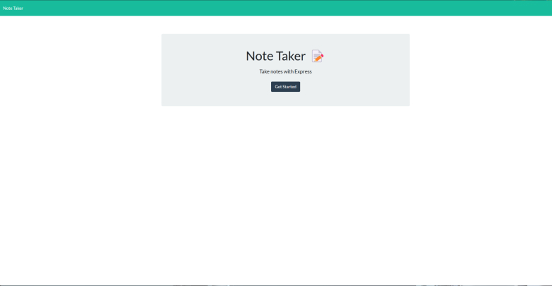
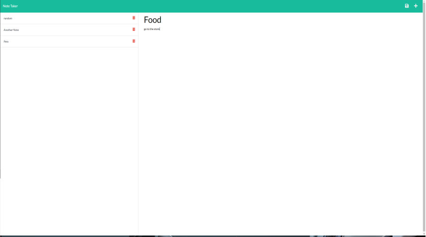

# Note Taker Node App


## Description

This is a simple note taking application that saves the users notes to a file. This application will allow the user to create update and delete their notes. This application uses a Json file to save the notes. 

---

### Table of Contents

- [Installation](#installation)
- [Usage](#usage)
- [Technologies](#technologies)
- [User-Story](#user-story)
- [Acceptance-Criteria](#acceptance-criteria)
- [Screenshots](#screenshots)
- [CodeSnippets](#codeSnippets)
- [License](#license)
- [Contributors](#contributors)
- [Tests](#tests)
- [Important-Information-Questions](#important-information-questions)

---

## Installation

Express and Node will need to be installed to run this application.

---

## Usage

To use the application the user clicks the get started button from the home page. The application will be loaded and the user will be able to create note. When the user types the note title and the note text into the input fields, a save button will appear in the top right corner of the application. When the user saves the application the note it will appear on the left hand side of the screen with the other saved notes. The user can edit existing notes by clicking on them and saving the changes or delete the notes by clicking the trash can button. 

---

## Technologies

- **Express.js**
- **Json**
- **Heroku**
- **JavaScript**
- **HTML**
- **CSS**

---

## User Story

```
AS A small business owner
I WANT to be able to write and save notes
SO THAT I can organize my thoughts and keep track of tasks I need to complete
```

---

## Acceptance Criteria

```
GIVEN a note-taking application
WHEN I open the Note Taker
THEN I am presented with a landing page with a link to a notes page
WHEN I click on the link to the notes page
THEN I am presented with a page with existing notes listed in the left-hand column, plus empty fields to enter a new note title and the note’s text in the right-hand column
WHEN I enter a new note title and the note’s text
THEN a Save icon appears in the navigation at the top of the page
WHEN I click on the Save icon
THEN the new note I have entered is saved and appears in the left-hand column with the other existing notes
WHEN I click on an existing note in the list in the left-hand column
THEN that note appears in the right-hand column
WHEN I click on the Write icon in the navigation at the top of the page
THEN I am presented with empty fields to enter a new note title and the note’s text in the right-hand column
```

---

## Screenshots

#### Home page



#### ToDo page



---

## CodeSnippets

#### Generates all notes that are currently available

```JavaScript
app.get('/api/notes', (req, res) => {
	fileSystem.readFile('./db/notesDB.json', 'utf8', (error, notes) => {
		 error ? console.error(error) : res.json(JSON.parse(notes));
	});
});
```

#### Deletes a note by its ID

```JavaScript
app.delete('/api/notes/:id', (req, res) => {
	const noteId = req.params.id;
	fileSystem.readFile('./db/notesDB.json', 'utf8', (error, notesObj) => {
		if (error) {
			console.error(error);
		} else {
			let notes = JSON.parse(notesObj);
			console.log('notes return' + notes);
			notes.forEach((note, index) => {
				console.log(index);
				if (note.id === noteId) {
					notes.splice(index, 1);
					notesDB = notes;
					fileSystem.writeFile(
						'./db/notesDB.json',
						JSON.stringify(notes, null, '\t'),
						(error) => {
							error
								? console.error(error)
								: console.info('Successfully updated notes!');
						}
					);
					res.json(notesDB);
				}
			});
		}
	});
});
```

---

## Tests

N/A

---

## **Important-Information-Questions**

---

## License

The license used on this project was MIT license

[license link](https://opensource.org/licenses/MIT)

## Contributors

Kyle Vance

## Questions

If you have any questions regarding this project, please reach me by email at vanceofalifetime@protonmail.com

[Live Link](https://note-taker-ksv.herokuapp.com/)

[LinkedIn](https://www.linkedin.com/in/kyle-s-vance/)
